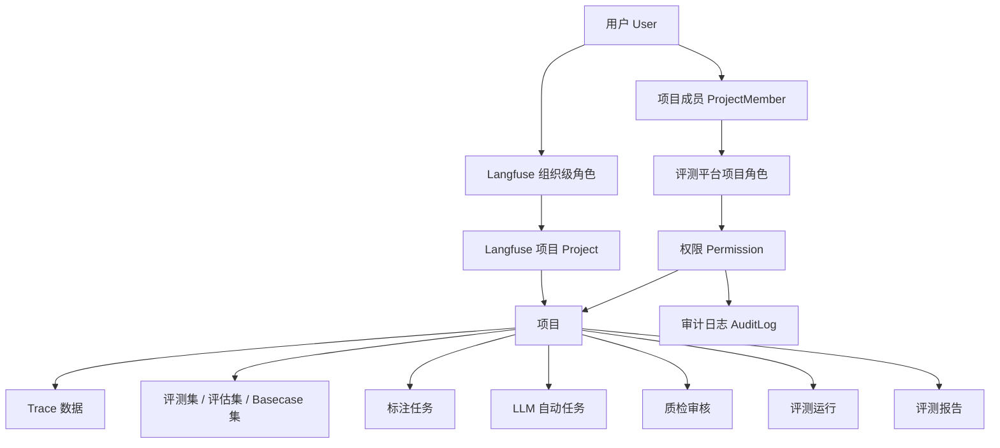
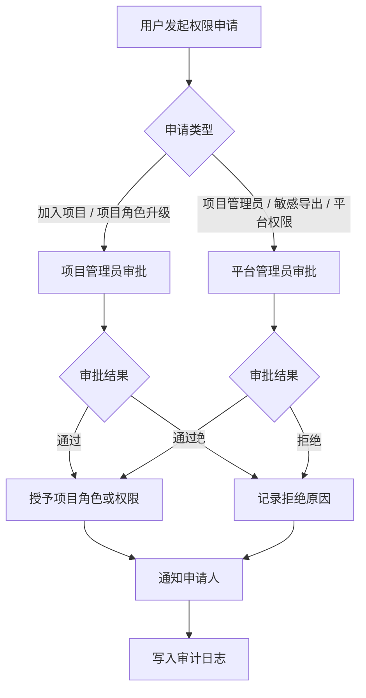
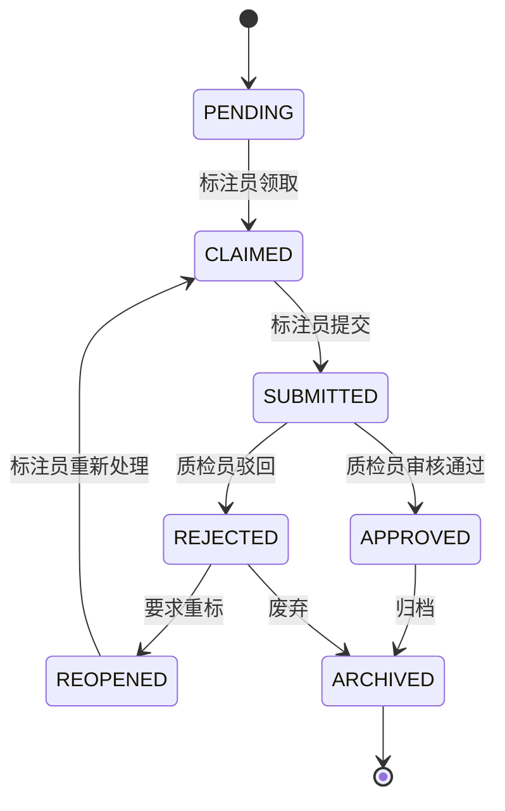

# 基于 Langfuse 的评测平台权限管理体系设计

## 1. 背景与目标

当前评测平台以 Langfuse 的可观测性能力为基础，承接 Trace 数据管理、数据标注、评测运行与评测报告等业务能力。Langfuse 已提供基于用户、组织、项目、角色的 RBAC 权限体系，组织是顶层实体，项目承载具体数据，用户默认继承组织级角色，也可以在项目级配置更细粒度角色；当项目级角色存在时，以项目级角色覆盖组织级角色。

本方案采用“兼容扩展”的方式：不直接改造 Langfuse 原生角色模型，而是在评测平台侧围绕项目建立扩展 RBAC 权限层，补足标注、质检、评测与报告等业务权限。

设计目标：

- 以项目为核心进行权限隔离，支持用户在多个项目中拥有不同职责。
- 兼容 Langfuse 组织/项目级权限语义，降低接入与升级成本。
- 支撑 Trace 数据、评测集、评估集、Basecase 集、评测报告等核心对象的访问控制。
- 支撑人工标注、LLM 自动任务、人工质检、审核流转、权限申请和审计追踪。
- 第一版保持 RBAC 简洁可落地，仅补充必要业务约束，不引入复杂 ABAC 策略引擎。

参考资料：

- [Langfuse Access Control (RBAC)](https://langfuse.com/docs/administration/rbac)

## 2. 权限模型总览

### 2.1 分层模型

权限体系分为三层：

| 层级 | 责任边界 | 说明 |
| --- | --- | --- |
| Langfuse 原生 RBAC | 组织、项目、基础数据访问 | 保留 Owner、Admin、Member、Viewer、None 等角色语义 |
| 评测平台扩展 RBAC | 项目内标注、质检、评测、报告 | 在项目维度增加业务角色与权限 |
| 业务约束规则 | 标注审核、敏感操作、审计 | 例如质检员不能审核自己提交的标注 |

项目是评测平台的最小权限隔离单元。同一用户可以加入多个项目，并在不同项目中拥有不同角色。



### 2.2 与 Langfuse 的兼容关系

Langfuse 原生角色建议映射如下：

| Langfuse 角色 | 原生定位 | 评测平台建议映射 |
| --- | --- | --- |
| Owner | 拥有全部权限 | 可映射为平台管理员或组织级超级管理员 |
| Admin | 管理项目设置和成员访问 | 可映射为项目管理员 |
| Member | 查看指标、创建分数，不能配置项目 | 可映射为项目普通用户，按需叠加标注或质检角色 |
| Viewer | 只读访问 | 可映射为项目普通用户 |
| None | 组织级无默认访问 | 用于仅授予特定项目访问权限的用户 |

落地建议：

- Langfuse 继续负责组织、项目、Trace、API Key 等基础访问控制。
- 评测平台维护自己的项目成员表、业务角色表和权限表。
- 对 Langfuse 项目内数据的访问，必须同时满足 Langfuse 基础访问与评测平台业务权限。
- 对项目级权限，以评测平台项目角色为准；对组织级管理权限，以 Langfuse 或统一身份平台的管理员权限为准。

## 3. 角色体系设计

### 3.1 角色定义

| 角色 | 角色编码 | 作用域 | 角色定位 |
| --- | --- | --- | --- |
| 平台管理员 | `PLATFORM_ADMIN` | 全平台 | 管理租户、用户、项目、安全策略、高危权限与全局审计 |
| 项目管理员 | `PROJECT_ADMIN` | 单项目 | 管理项目成员、角色、数据资产、评测配置与项目级权限审批 |
| 项目普通用户 | `PROJECT_VIEWER` | 单项目 | 查看项目内 Trace、数据集、评测结果和报告，并可创建评分任务 |
| 项目标注员 | `PROJECT_ANNOTATOR` | 单项目 | 在只读基础上领取、提交、修改本人未审核标注 |
| 项目质检员 | `PROJECT_REVIEWER` | 单项目 | 审核标注结果、退回、复核、抽检，查看质检统计 |

### 3.2 角色继承与叠加规则

- `PLATFORM_ADMIN` 拥有全平台管理能力，但所有高危操作仍记录审计日志。
- 项目级角色仅在所属项目内生效，不能跨项目继承。
- 同一用户可在不同项目拥有不同角色。
- 同一项目内如果用户拥有多个业务角色，权限默认取并集。
- 高危权限不通过普通并集自动获得，需显式授权或审批，例如批量导出、删除数据集、转移项目。
- 质检员不能审核自己提交的标注，即使其同时拥有标注员角色。
- 项目管理员可以配置项目成员和评测流程，但不默认具备平台级用户管理能力。

## 4. 核心资源与权限矩阵

### 4.1 资源域

| 资源域 | 资源对象 | 典型动作 |
| --- | --- | --- |
| 项目管理 | 项目基础信息、项目配置 | `view/create/update/delete/transfer` |
| 成员管理 | 项目成员、项目角色 | `view/invite/update/remove/approve` |
| Trace 数据 | Trace、Observation、Score | `view/tag/export/import` |
| 数据集管理 | 评测集、评估集、Basecase 集 | `view/create/update/delete/publish/export` |
| 评分任务 | 评分任务、评分结果 | `view/create/cancel` |
| 标注任务 | 标注任务、标注结果 | `view/claim/submit/update/cancel` |
| LLM 自动任务 | LLM 自动标注、自动评分、自动生成用例 | `view/create/update/execute/cancel` |
| 质检审核 | 审核记录、抽检规则 | `view/approve/reject/reopen/sample` |
| 评测运行 | 评测任务、评测配置、运行记录 | `view/create/update/execute/cancel` |
| 报告管理 | 评测报告、报告模板 | `view/create/update/delete/export/publish` |
| 审计日志 | 操作日志、权限变更记录 | `view/export` |

### 4.2 角色权限矩阵

| 权限项 | 平台管理员 | 项目管理员 | 普通用户 | 标注员 | 质检员 |
| --- | --- | --- | --- | --- | --- |
| 查看项目 | 全部项目 | 本项目 | 本项目 | 本项目 | 本项目 |
| 创建项目 | 是 | 按组织策略 | 否 | 否 | 否 |
| 修改项目配置 | 是 | 本项目 | 否 | 否 | 否 |
| 删除/归档项目 | 是 | 需平台审批 | 否 | 否 | 否 |
| 查看项目成员 | 是 | 本项目 | 否 | 否 | 否 |
| 邀请/移除成员 | 是 | 本项目 | 否 | 否 | 否 |
| 分配项目角色 | 是 | 本项目，不能授予高于自身权限 | 否 | 否 | 否 |
| 查看 Trace 数据 | 是 | 本项目 | 本项目 | 本项目 | 本项目 |
| 标记/整理 Trace | 是 | 本项目 | 否 | 本人任务相关 | 审核相关 |
| 导出 Trace 数据 | 是 | 需审批或策略允许 | 否 | 否 | 需审批 |
| 查看数据集 | 是 | 本项目 | 本项目 | 本项目 | 本项目 |
| 创建/编辑数据集 | 是 | 本项目 | 否 | 仅标注产物相关 | 审核通过产物相关 |
| 删除数据集 | 是 | 需审批 | 否 | 否 | 否 |
| 创建评分任务 | 是 | 本项目 | 本项目 | 本项目 | 本项目 |
| 创建 LLM 自动任务 | 是 | 本项目 | 否 | 否 | 否 |
| 运行/取消 LLM 自动任务 | 是 | 本项目 | 否 | 否 | 否 |
| 查看 LLM 自动任务结果 | 是 | 本项目 | 本项目 | 本项目 | 本项目 |
| 领取标注任务 | 否 | 可配置/代分配 | 否 | 是 | 可选 |
| 提交标注结果 | 否 | 可代处理 | 否 | 是 | 可选 |
| 修改本人未审核标注 | 否 | 可代处理 | 否 | 是 | 是 |
| 审核标注结果 | 否 | 可配置/兜底审核 | 否 | 否 | 是 |
| 驳回/要求重标 | 否 | 可配置/兜底审核 | 否 | 否 | 是 |
| 抽检标注结果 | 是 | 本项目 | 否 | 否 | 是 |
| 创建评测配置 | 是 | 本项目 | 否 | 否 | 否 |
| 运行评测 | 是 | 本项目 | 否 | 否 | 否 |
| 查看评测报告 | 是 | 本项目 | 本项目 | 本项目 | 本项目 |
| 发布评测报告 | 是 | 本项目 | 否 | 否 | 否 |
| 导出评测报告 | 是 | 本项目，按策略 | 只读报告可导出时 | 否 | 按策略 |
| 查看审计日志 | 是 | 本项目 | 否 | 否 | 仅质检相关 |
| 导出审计日志 | 是 | 需平台审批 | 否 | 否 | 否 |

说明：

- “可配置/兜底审核”表示项目管理员可以在小团队场景兼任流程处理人，但正式生产流程建议由质检员执行。
- 平台管理员不直接参与标注业务动作，除非作为应急处理；这类操作必须进入审计。
- 数据导出、项目删除、审计导出属于高危操作，应接入审批或安全策略。

## 5. 权限申请与审批流程

### 5.1 申请类型

| 申请类型 | 发起人 | 审批人 | 典型场景 |
| --- | --- | --- | --- |
| 加入项目 | 平台用户 | 项目管理员 | 用户需要查看或参与某项目 |
| 项目角色升级 | 项目成员 | 项目管理员 | 普通用户申请成为标注员或质检员 |
| 项目管理员权限 | 项目成员 | 平台管理员 | 申请管理项目成员、配置与评测任务 |
| 敏感数据导出 | 项目成员 | 项目管理员 + 平台管理员 | 导出 Trace、评测集或审计日志 |
| 平台管理员权限 | 管理人员 | 现有平台管理员 | 全局用户、项目、安全管理 |

### 5.2 流程图



### 5.3 审批策略

- 项目级普通权限由项目管理员审批。
- 跨项目权限、平台管理员权限、高危导出、项目删除由平台管理员审批。
- 项目管理员不能审批自己的管理员权限申请。
- 审批记录必须包含申请人、审批人、申请项目、目标角色、理由、结果、时间和备注。
- 权限支持有效期，临时权限到期后自动回收。
- 权限变更后应通知申请人与项目管理员。

## 6. 标注与质检流程

### 6.1 状态定义

| 状态 | 说明 |
| --- | --- |
| `PENDING` | 待标注，任务已创建但未领取 |
| `CLAIMED` | 已领取，标注员处理中 |
| `SUBMITTED` | 已提交，等待质检审核 |
| `APPROVED` | 审核通过，可进入评估集/Basecase 集或报告生产 |
| `REJECTED` | 审核驳回，需要重标或修正 |
| `REOPENED` | 已重新打开，进入再次标注 |
| `ARCHIVED` | 已归档，不再参与流程 |

### 6.2 状态流转图



### 6.3 业务约束

- 标注员只能修改本人提交且尚未审核通过的标注。
- 质检员不能审核自己提交的标注。
- 被驳回的标注必须保留原提交版本和驳回原因。
- 审核通过后，标注结果进入只读状态；如需修改，必须重新打开任务并产生新版本。
- 抽检可以针对已通过的结果进行复核，复核结论应记录到质检统计。
- 进入评估集或 Basecase 集的数据必须来自已通过审核的标注结果，除非项目管理员显式配置免审策略。

## 7. 数据模型建议

### 7.1 核心实体

| 实体 | 关键字段 | 说明 |
| --- | --- | --- |
| `User` | `id`, `email`, `name`, `status` | 平台用户，与身份认证系统或 Langfuse 用户关联 |
| `Project` | `id`, `langfuseProjectId`, `name`, `ownerId`, `status` | 评测平台项目，与 Langfuse Project 建立映射 |
| `Role` | `id`, `code`, `name`, `scope`, `description` | 角色定义 |
| `Permission` | `id`, `resource`, `action`, `description` | 权限原子项 |
| `ProjectMember` | `projectId`, `userId`, `roles`, `status`, `expiresAt` | 项目成员与角色绑定 |
| `PermissionRequest` | `id`, `requesterId`, `projectId`, `targetRole`, `reason`, `status` | 权限申请 |
| `AuditLog` | `id`, `actorId`, `projectId`, `action`, `resourceType`, `resourceId`, `result` | 审计日志 |
| `AnnotationTask` | `id`, `projectId`, `traceId`, `assigneeId`, `status`, `version` | 标注任务 |
| `LlmAutoTask` | `id`, `projectId`, `taskType`, `inputScope`, `modelConfig`, `status`, `createdBy` | LLM 自动任务 |
| `ReviewRecord` | `id`, `taskId`, `reviewerId`, `result`, `comment`, `createdAt` | 质检审核记录 |

### 7.2 权限命名建议

权限编码采用 `resource:action` 格式：

| 示例 | 含义 |
| --- | --- |
| `project:view` | 查看项目 |
| `project:update` | 修改项目配置 |
| `member:invite` | 邀请项目成员 |
| `trace:view` | 查看 Trace |
| `trace:export` | 导出 Trace |
| `dataset:create` | 创建数据集 |
| `score-task:create` | 创建评分任务 |
| `annotation:claim` | 领取标注任务 |
| `annotation:submit` | 提交标注 |
| `llm-task:create` | 创建 LLM 自动任务 |
| `llm-task:execute` | 运行 LLM 自动任务 |
| `review:approve` | 审核通过 |
| `review:reject` | 审核驳回 |
| `eval:execute` | 运行评测 |
| `report:publish` | 发布报告 |
| `audit:view` | 查看审计 |

## 8. 典型访问控制判断

### 8.1 项目访问判断

```text
用户请求访问项目资源
1. 校验用户是否具备 Langfuse 项目基础访问权限。
2. 查询评测平台 ProjectMember 记录。
3. 计算用户在该项目内的角色权限并集。
4. 校验目标资源和动作是否在权限集合内。
5. 如为高危操作，继续校验审批记录、安全策略或临时授权。
6. 写入访问或操作审计。
```

### 8.2 标注审核判断

```text
质检员审核标注任务
1. 校验用户是否拥有 review:approve 或 review:reject 权限。
2. 校验任务属于用户当前项目。
3. 校验任务状态为 SUBMITTED。
4. 校验任务提交人不是当前审核人。
5. 写入 ReviewRecord。
6. 更新 AnnotationTask 状态。
7. 写入审计日志。
```

## 9. 审计与安全要求

必须记录审计的操作：

- 用户登录、退出、认证失败。
- 项目创建、删除、归档、转移。
- 成员邀请、移除、角色变更。
- 权限申请、审批、拒绝、撤销。
- Trace、数据集、评测报告导出。
- 标注提交、审核通过、驳回、重开。
- LLM 自动任务创建、运行、取消、结果入库。
- 评测任务创建、运行、取消。
- 安全策略变更。

审计字段建议：

| 字段 | 说明 |
| --- | --- |
| `actorId` | 操作人 |
| `projectId` | 所属项目 |
| `action` | 操作动作 |
| `resourceType` | 资源类型 |
| `resourceId` | 资源 ID |
| `before` | 变更前内容，可脱敏 |
| `after` | 变更后内容，可脱敏 |
| `result` | 成功或失败 |
| `ip` | 操作来源 IP |
| `userAgent` | 客户端信息 |
| `createdAt` | 操作时间 |

安全要求：

- 最小权限原则：新用户默认无项目访问权限或仅为只读角色。
- 权限有效期：临时角色必须设置过期时间。
- 高危操作二次确认：删除、导出、转移、批量变更必须二次确认或审批。
- 数据脱敏：导出 Trace 或报告时按项目策略脱敏敏感字段。
- 职责分离：标注与审核原则上由不同人员完成。

## 10. 评审用例与验收标准

### 10.1 评审用例

| 用例 | 预期结果 |
| --- | --- |
| 普通用户访问项目 Trace | 可以查看 |
| 普通用户创建评分任务 | 成功 |
| 普通用户创建 LLM 自动任务 | 被拒绝 |
| 普通用户提交标注 | 被拒绝 |
| 普通用户运行评测 | 被拒绝 |
| 标注员领取并提交任务 | 成功 |
| 标注员审核自己的标注 | 被拒绝 |
| 质检员审核他人标注 | 成功 |
| 质检员管理项目成员 | 被拒绝，除非同时具备项目管理员角色 |
| 项目管理员邀请成员 | 成功，仅限本项目 |
| 项目管理员创建并运行 LLM 自动任务 | 成功，仅限本项目 |
| 项目管理员访问其他项目 | 被拒绝，除非在其他项目也有角色 |
| 平台管理员查看全局审计 | 成功 |
| 敏感导出未审批 | 被拒绝 |
| 权限申请被拒绝 | 记录拒绝原因并写入审计 |

### 10.2 文档验收标准

- 角色定位清晰，能覆盖平台管理、项目管理、查看、标注、质检五类职责。
- 权限矩阵覆盖项目、成员、Trace、数据集、评分任务、标注、LLM 自动任务、质检、评测、报告、审计。
- 权限申请流程可落地，明确审批人和审计要求。
- 标注与质检流程明确状态流转和职责分离规则。
- 架构图、权限申请流程图、标注质检状态图均可用 Mermaid 渲染。
- 明确说明与 Langfuse 现有 RBAC 的兼容方式。

## 11. 分阶段落地建议

### 第一阶段：基础 RBAC

- 建立项目成员、角色、权限、审计日志模型。
- 支持项目管理员、普通用户、标注员、质检员角色。
- 支持项目内访问控制和权限矩阵校验。

### 第二阶段：标注与质检闭环

- 建立标注任务、LLM 自动任务、审核记录和状态流转。
- 支持领取、提交、审核、驳回、重开、抽检。
- 将审核通过的数据接入评估集和 Basecase 集。

### 第三阶段：审批与高危权限

- 建立权限申请、审批、临时授权和权限回收。
- 对数据导出、项目删除、审计导出等高危动作接入审批。
- 完善通知、审计查询与安全策略。

### 第四阶段：治理增强

- 支持权限模板、批量授权、到期提醒。
- 支持项目维度权限报表和质检统计。
- 根据实际业务复杂度评估是否引入策略引擎或 ABAC。
